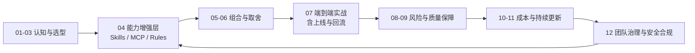

# AI 赋能 Android 开发 · 最佳实践

面向有经验的 Android 开发者，以技术博客的形式系统阐述如何将 AI Coding 工具和流程正确引入 Android 开发。从工具选型、Skills 配置到全流程落地，分享真实的经验、数据和踩坑记录。

> 时效性说明
> - 最后更新：2026-05
> - 全局统计周期：以 2026 Q1（2026-01 ~ 2026-03）为主；跨年对比会在文内单独注明
> - 复核建议：模型能力、工具功能、定价和政策变化快，落地前请以官方最新信息复核
> - 标注规范：详见 [`docs/时效性标注规范.md`](./docs/时效性标注规范.md)

## 适合谁读

- 日常使用 Android/Kotlin/Compose/Gradle 技术栈的**资深开发者**
- 已有一定 AI 工具使用经验，但缺乏系统化方法和团队落地指南
- 希望将 AI 辅助真正融入需求→设计→编码→测试→交付全流程

## 目录

| 篇章 | 章节 |
|------|------|
| **基础篇** | [第 1 章 · 背景与趋势](./docs/01-背景与趋势.md) |
| | [第 2 章 · 大模型选型](./docs/02-大模型选型.md) |
| | [第 3 章 · Coding 工具对比](./docs/03-Coding工具对比.md) |
| | [第 4 章 · 效率神器：Skills 与 MCP](./docs/04-效率神器Skills与MCP.md) |
| **实战篇** | [第 5 章 · 高赞 Skills 对比](./docs/05-高赞Skills对比.md) |
| | [第 6 章 · Skills 筛选策略](./docs/06-Skills筛选策略.md) |
| | [第 7 章 · 接入项目全流程](./docs/07-接入项目全流程.md) |
| | [第 8 章 · 常见陷阱与解决方案](./docs/08-常见陷阱与解决方案.md) |
| | [第 9 章 · 效率与准确率保障](./docs/09-效率与准确率保障.md) |
| **进阶篇** | [第 10 章 · Token 经济学](./docs/10-Token经济学.md) |
| | [第 11 章 · 持续更新](./docs/11-持续更新.md) |
| **治理篇** | [第 12 章 · 团队治理与安全合规](./docs/12-团队治理与安全合规.md) |

## 快速开始

根据你的需求和角色选择不同阅读路径：

- **新手入门** → 按顺序阅读 1 → 2 → 3 → 4 → 5 → 6 → 7 → 8 → 9 → 10 → 11 → 12
- **有经验想快速上手** → 复制 [`templates/rules/CLAUDE.md`](./templates/rules/CLAUDE.md) 到项目根 → 读 5 → 6 → 7 → 9 → 12
- **要复现模型评测** → [`fixtures/android-benchmark/`](./fixtures/android-benchmark/) + 第 2 章
- **发包 / PR 检查** → [`templates/release-checklist.md`](./templates/release-checklist.md)（第 7 章 §7.0）
- **Tech Lead / 架构师** → 重点读 3 → 6 → 7 → 10 → 11 → 12

## AI-Coding 全流程导航

如果你想按“从认知到落地再到复利”的完整链路阅读，可以按这个闭环走：

1. 认知与边界：`01`（趋势） + `02`（模型） + `03`（工具）
2. 能力增强层：`04`（Skills/MCP/Rules）
3. 组合与取舍：`05`（Skill 评测） + `06`（筛选与去重）
4. 端到端实战：`07`（PRD → UI → 开发 → 测试 → 上线与回流）
5. 风险治理：`08`（常见陷阱） + `09`（质量防线与度量）
6. 成本优化与持续进化：`10`（Token 经济学） + `11`（持续更新机制）
7. 团队治理与安全合规：`12`（权限、审计、边界、应急）

这套路径对应一个完整闭环：
**需求输入 → 设计与实现 → 质量保障 → 发布回流 → 规则沉淀 → 下一轮提效**。

### 一图看全流程（章节导航图）

GitHub 对 README 内嵌 SVG 预览支持不稳定，这里使用 Mermaid，在仓库页面可直接渲染：

图源文件（可选编辑）：[`docs/images/00-全局/ai-coding-全流程章节导航图.mmd`](./docs/images/00-全局/ai-coding-全流程章节导航图.mmd)

[每周 AI / AI-Coding GitHub 热榜追踪（自 2026-01）](./docs/每周AI与AI-Coding热榜.md)

## 阅读风格

本系列采用技术博客风格——叙事化、观点鲜明、数据驱动。每篇文章围绕真实场景展开，而非教科书式的分节教学。

## 贡献

这是一个持续更新的活文档。欢迎通过 PR 提交：
- 新的 Skills 评测评判
- 踩坑记录与解决方案
- Android 工具链适配经验

有疑问或建议，请提 Issue 讨论。
