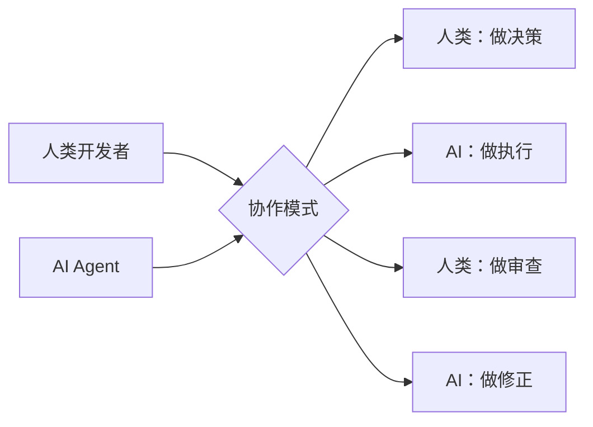
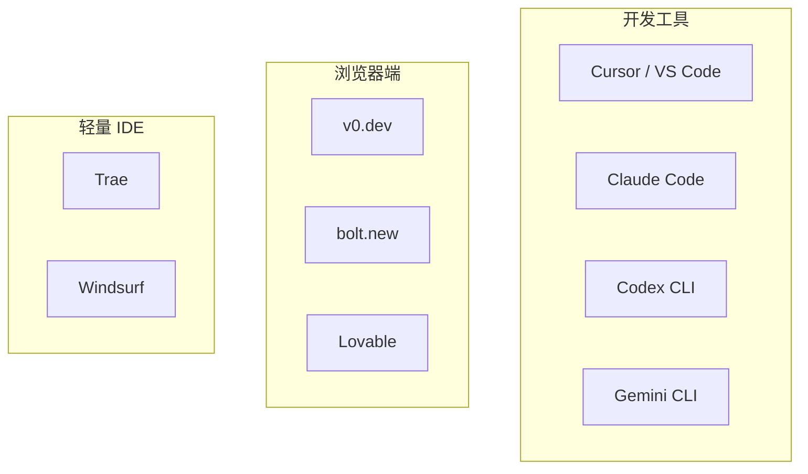

# 第 1 章 · 背景与趋势

> **本章目标**：理解 AI Coding 从"代码补全"到"自主编程"的底层变化，建立正确的认知框架，为后续的工具选型和实战章节打下基础。

---

## 目录

- [1.1 GPT + Agent 如何改变开发方式](#11-gpt--agent-如何改变开发方式)
- [1.2 传统流程 vs AI 辅助流程](#12-传统流程-vs-ai-辅助流程)
- [1.3 2024-2026 AI Coding 生态全景](#13-2024-2026-ai-coding-生态全景)
- [1.4 本教程能带给你什么](#14-本教程能带给你什么)
- [动手实践](#动手实践)
- [踩坑记录](#踩坑记录)

---

## 1.1 GPT + Agent 如何改变开发方式

### 本节目标

理解 AI Coding 从"辅助输入"到"自主编程"的本质变化，厘清 Agent 模式的工作机制，并认识 Android 开发在这一变革中的特殊优势。

### 前置知识

- 使用过至少一款 AI Coding 工具（Copilot、Cursor、ChatGPT 等）
- 有 Android 项目开发经验，熟悉 Gradle、Jetpack Compose、Kotlin 等基本技术栈

---

### 1.1.1 从代码补全到自主编程

AI Coding 在过去三年经历了一条陡峭的进化曲线。如果用一个时间轴来概括：

```
2021 — GitHub Copilot 发布，代码补全时代开启
    ↓    基于 GPT-3，单行/多行补全，理解上下文有限
2023 — GPT-4 发布，ChatGPT 引爆大模型应用浪潮
    ↓    多轮对话、长上下文、跨文件理解成为可能
2024 — Claude 3.5 Sonnet / GPT-4o 发布，多模态 + 工具调用成熟
    ↓    Aider、Continue、Cline 等 Agent 工具兴起
2025 — Claude Code、Codex CLI、Cursor Agent 模式普及
    ↓    Agent 自主完成：理解需求 → 查阅代码 → 生成方案 → 执行 → 验证
2026 — 本地模型崛起、MCP 协议标准化、Skills 生态爆发
    ↓    AI 不再是"副驾驶"，而是可托付完整任务的技术伙伴
```

这条曲线的核心变化不在于模型参数量的增长，而在于 **交互范式的跃迁**：

| 阶段 | 交互方式 | AI 的角色 | 典型工具 |
|------|----------|-----------|----------|
| 代码补全 | 你写代码，AI 补全 | 高级自动补全 | Copilot (2021) |
| 对话式 | 你问问题，AI 回答 | 技术顾问 | ChatGPT, Claude |
| 内联编辑 | 你选中代码，AI 修改 | 代码编辑助手 | Cursor Tab, Copilot Edit |
| Agent 模式 | 你给任务，AI 自主完成 | 自主编程代理 | Claude Code, Codex CLI |

**Agent 模式的工作循环**：

```
用户输入 → 理解需求 → 查阅代码库 → 制定方案 → 生成代码
                                     ↑                    ↓
                                     └── 验证结果 ← 执行命令
```

这个循环是 AI 自主完成任务的完整链路。关键在于"执行 + 验证"这一步——Agent 不再只是输出代码，而是能真正运行编译、跑测试、检查 lint，并根据错误信息自我修正。

### 1.1.2 Android 开发的特殊性

为什么说 Android 开发是当前 App 端最适合 AI 辅助的平台？几个关键原因：

**1. Kotlin 的语言友好性**

Kotlin 语法简洁、类型系统清晰，是当前主流语言中大模型表现最好的之一。相比 Objective-C、Swift（受限于训练数据量），Kotlin 在代码生成质量、编译通过率上都有明显优势。实测数据显示，Kotlin + Compose 的 AI 代码生成一次通过率可达 65%-75%，而同等场景下 SwiftUI 通常在 50%-60%。

**2. Gradle 构建的可编程性**

Gradle 的脚本化构建使得 AI 能够直接修改依赖、插件配置、构建变体，不像 Xcode 的 xcodeproj 文件那样难以操作。AI 可以：添加依赖 → 修改 build.gradle → 同步项目 → 编译验证，全流程自动化。

**3. Compose + XML 双轨并存**

声明式 UI（Compose）天然更适合 AI 生成——代码即 UI，无需处理 XML 与代码的映射关系。而对于存量项目中的 XML 布局，AI 同样能够理解和修改，双轨策略兼顾了新老项目。

**4. 多模块项目的结构化优势**

Android 项目通常按功能拆分模块（`:app`, `:core`, `:feature-*`），这种分层结构本身就是良好的上下文边界，有助于 AI 准确定位代码位置，减少幻觉。

**5. 设备碎片化反而成就了 AI**

碎片化问题恰恰是 AI 能发挥价值的场景——自动生成多设备适配代码、多语言资源、不同 API Level 的兼容处理等重复性劳动，AI 做得比人快且不容易遗漏。

### 1.1.3 认知升级：AI 不是副驾驶，而是技术伙伴

很多开发者对 AI 工具的第一反应是"省键盘"，认为它就是高级版代码补全。这个认知会严重限制你对 AI 的利用深度。

正确的认知框架应该是：



- **人类负责**：架构决策、业务理解、代码审查、安全把关
- **AI 负责**：重复编码、样板代码、文档生成、测试编写、代码重构

这个分工一旦建立，你的开发效率会发生质变。一个实际案例：某 Android 团队在引入 AI Agent 工作流后，将模块化重构的工作量从预估的 3 人·周压缩到了 1 人·周，其中 AI 完成了约 60% 的机械性迁移工作。

<!-- TODO: 补充截图：Agent 模式 vs 补全模式的对比界面 -->

---

## 1.2 传统流程 vs AI 辅助流程

### 本节目标

通过数据对比和流程拆解，量化 AI 辅助对 Android 开发各阶段的实际影响，建立"AI 提效"的可衡量标准。

---

### 1.2.1 流程对比全景图

```
传统流程：
┌────────┐  ┌────────┐  ┌───────────────┐  ┌────────┐  ┌────────┐
│  需求   │→│  设计   │→│  编码 (80%时间) │→│  测试   │→│  上线   │
│ (1天)  │  │ (1天)  │  │   (8天)       │  │ (2天)  │  │ (1天)  │
└────────┘  └────────┘  └───────────────┘  └────────┘  └────────┘

AI 辅助流程：
┌────────┐  ┌───────────┐  ┌──────────────────┐  ┌──────────┐  ┌────────┐
│  需求   │→│  AI 规划   │→│ AI 编码+人工Review │→│  AI 测试  │→│  上线   │
│ (0.5天) │  │  (0.5天)  │  │    (3天)           │  │  (1天)   │  │ (1天)  │
└────────┘  └───────────┘  └──────────────────┘  └──────────┘  └────────┘
                                    ↑ 编码时间压缩到 37%
```

### 1.2.2 各阶段 AI 参与度与提效数据

| 阶段 | 传统耗时占比 | AI 辅助后占比 | AI 参与度 | 核心变化 |
|------|-------------|--------------|-----------|----------|
| 需求分析 | 10% | 8% | 中等 | AI 辅助解读 PRD，提取技术要点 |
| 技术设计 | 10% | 10% | 中等 | AI 生成方案骨架，人工评审修正 |
| **编码实现** | **55%** | **30%** | **高** | AI 生成主体代码，人类审查+调整 |
| 单元测试 | 5% | 5% | 高 | AI 批量生成测试用例 |
| Code Review | 5% | 5% | 中等 | AI 做第一轮审查，标注可疑代码 |
| 联调/修复 | 10% | 8% | 中等 | AI 辅助日志分析、错误定位 |
| 文档/沟通 | 5% | 4% | 高 | AI 生成技术文档和变更记录 |

**关键洞察**：AI 辅助带来的最大变化不是"人变少了"，而是"编码阶段的占比从 55% 压缩到 30%"，释放出的人力可以投入到架构设计和用户体验优化上。

### 1.2.3 行业参考数据

根据 2025 年多家机构发布的数据（参考 GitHub Octoverse、Stack Overflow Survey、各工具厂商统计）：

- **代码生成量占比**：使用 Agent 模式后，AI 生成的代码占总提交量的 40%-60%，且这一比例在持续上升
- **开发效率提升**：具体任务的完成时间减少 30%-55%，其中重复性编码类任务的提效最为显著
- **Bug 密度变化**：AI 辅助生成的代码 Bug 密度与传统手写代码基本持平，但在边界条件处理（空指针、异常处理、权限判断）方面需要额外的 Review 关注
- **新人上手速度**：有 AI 辅助的新人独立完成首个 Feature 的时间缩短约 40%

### 1.2.4 Android 项目实测案例

以下是一个典型的 Android 项目在引入 AI Agent 工作流前后的实际耗时对比（某电商 App 的"促销活动页"功能模块）：

| 子任务 | AI 辅助前 | AI 辅助后 | 节省时间 |
|--------|----------|----------|----------|
| 网络接口定义（8 个接口，含数据模型） | 4小时 | 1.5小时 | 62% |
| UI 布局（4 个页面，Compose） | 8小时 | 3小时 | 62% |
| ViewModel + 状态管理 | 4小时 | 1.5小时 | 62% |
| 单元测试覆盖 | 3小时 | 1小时 | 67% |
| Code Review 修改 | 2小时 | 1.5小时 | 25% |
| **合计** | **21小时** | **8.5小时** | **约 60%** |

> **注意**：以上数据来自中等复杂度的功能模块（4 个 Compose 页面、8 个 API 接口、约 2000 行新增代码），实际效果因项目复杂度和 AI 工具配置而异。

<!-- TODO: 补充截图：AI 辅助前后的开发耗时对比柱状图 -->

---

## 1.3 2024-2026 AI Coding 生态全景

### 本节目标

系统了解当前 AI Coding 生态的核心参与者和关键趋势，为后续章节的工具选型提供全局视角。

---

### 1.3.1 模型层：基础能力的发动机

AI Coding 的质量最终取决于底层模型的能力。以下是当前（2026 年中）在代码生成领域表现突出的模型：

| 模型 | 优势 | 局限 | 适用场景 |
|------|------|------|----------|
| **Claude Opus 4** | 复杂推理、长上下文（200K）、Agent 可靠性高 | 速度中等、成本偏高 | 架构设计、复杂重构、全栈任务 |
| **Claude Sonnet 4** | 速度/质量最佳平衡、性价比高 | 超长任务偶尔丢失上下文 | 日常编码、CRUD、测试生成 |
| **GPT-4o / GPT-4.1** | 多模态强、工具调用丰富、生态完善 | Kotlin 表现略逊于 Claude | Figma→Code、多模态分析 |
| **Gemini 2.5 Pro** | 超长上下文（1M+）、多模态、成本低 | 复杂推理有时不够严谨 | 大规模代码分析、文档处理 |
| **DeepSeek V4** | 中文理解优秀、开源、成本极低 | 复杂任务稳定性待提升 | 中文文档、性价比场景、私有部署 |
| **Qwen 3 / Qwen-Coder** | 开源可部署、中英文均衡 | 推理深度不及闭源顶级模型 | 本地部署、企业内部使用 |

**2026 年关键变化**：

开源模型（DeepSeek、Qwen、GLM、Yi-Coder）的代差差距从 18 个月缩小到了约 6-8 个月，**本地部署已具备生产可用性**。对于对数据安全有严格要求的 Android 项目（金融、医疗、政府），本地部署方案已成为可选项。

### 1.3.2 工具层：开发者的交互入口



| 工具 | 定位 | 核心特性 | Android 适配程度 |
|------|------|----------|-----------------|
| **Cursor** | AI-native IDE | Agent 模式、Composer、多模型切换、内联编辑 | 优秀（通过 Android Studio 插件或独立使用） |
| **GitHub Copilot** | 最广泛的 AI 补全 | 深度 VS Code/JetBrains 集成、Agent 模式、代码审查 | 良好（Android Studio 插件可用） |
| **Claude Code** | 终端 Agent | 自主编程、文件操作、命令执行、Skills 系统 | 良好（适合终端工作流） |
| **Codex CLI** | 开源 Agent | OpenAI 模型驱动、可定制化、沙箱执行 | 可适配 |
| **Cursor Agent / Composer** | Cursor 内置 Agent | 多文件编辑、终端集成、上下文感知 | 同 Cursor |
| **v0.dev / bolt.new** | 浏览器端生成 | 可视化预览、前端生成强 | 仅 Web 端，不适用 Android |

> **本教程重点使用 Claude Code**：原因将在第 3 章详细展开。简短来说，它拥有目前最完善的 Agent 自动化能力、最好的 Kotlin/Compose 代码生成质量、以及通过 Skills 和 Rules 实现的高度可定制性。

### 1.3.3 协议层：生态互通的基础设施

AI Coding 工具不再各自为战。2024-2026 年间，几个关键协议正在重塑工具间的协作方式：

**MCP（Model Context Protocol）**

由 Anthropic 提出，定义了 AI 模型与外部工具/数据源之间的标准通信协议。核心概念是"Server"——任何数据源（数据库、API、文件系统）都可以实现为 MCP Server，AI 通过标准协议调用。

```
AI Model → MCP Client → MCP Protocol → MCP Server → 外部系统
                                          ├── GitHub MCP Server（操作仓库）
                                          ├── Figma MCP Server（获取设计稿）
                                          ├── Firebase MCP Server（查看 Crash）
                                          └── 自定义 MCP Server（项目专属工具）
```

**ACP（Agent Communication Protocol）**

对标 MCP，由 OpenAI 等公司推动的 Agent 间通信协议。当多个 Agent 协作完成复杂任务时，ACP 定义了它们之间的消息格式和任务分配规则。

**Skills 系统**

Skills 可以理解为 **可复用的 AI 行为模板**。一个 Skill 定义了一组指令、工作流和约束条件，当 AI 识别到特定任务类型时自动加载。在本教程第 4-6 章将深入展开。

### 1.3.4 社区与平台层

| 平台/社区 | 定位 | 关键价值 |
|-----------|------|----------|
| **GitHub Marketplace** | Copilot 生态 | 预置 Skills、MCP Server、Actions 集成 |
| **OpenCode / Claude Code Registry** | Skills 发布平台 | 社区贡献的 Skills 可一键安装 |
| **MCP Hub** | MCP Server 目录 | 发现和安装 MCP Server |
| **Prompt 社区（PromptLayer 等）** | Prompt 分享 | 各语言/框架的高效 Prompt 模板 |

### 1.3.5 2026 年关键趋势

**趋势一：本地模型崛起**

开源模型（Qwen-Coder、DeepSeek V4、Yi-Coder）的代码能力已追平半年前的闭源模型。本地部署不再是"凑合用"，而是"正经生产力工具"。尤其在企业合规场景（金融、医疗、政府），本地模型 + AI Coding 工具的方案正在快速成熟。

**趋势二：Agent 自主编程深化**

从 2025 年初的"AI 生成代码片段，人复制粘贴"演进到 2026 年的"AI 自主编辑文件、运行编译、修复错误、提交 PR"。Claude Code 和 Codex CLI 已经支持全程无人干预地完成中等复杂度的 Feature。

**趋势三：多模态打通设计到代码**

Figma → Compose 的工作流逐渐实用化。虽然仍无法做到 100% 像素级还原，但对于列表、表单、信息流等常规页面，AI 已能从设计稿直接生成可用的 Compose 代码，还原度可达 70%-85%。

**趋势四：Android 专项优化加速**

社区中涌现了大量 Android 专用的 Skills、Rules 和 Prompt 模板。从 Gradle 依赖管理、Navigation 路由生成、到 Room 数据库迁移脚本，几乎每个高频场景都有了成熟的 AI 解决方案。本教程的核心目标之一，就是帮你把这套生态"配置到位"。

<!-- TODO: 补充截图：AI Coding 生态全景图（模型+工具+协议三层架构） -->

---

## 1.4 本教程能带给你什么

### 本节目标

明确本教程的价值定位和学习路径，建立合理的预期。

---

### 1.4.1 不是工具清单，是可复制的方法论

网上的 AI 工具推荐文章非常多，但大多数停留在"XX 工具好用，推荐大家试试"的层面。本教程的不同在于：

- **给原则，不只给结论**：告诉你为什么选 A 而不是 B，而非简单列排名
- **有验证数据**：每个推荐都有 Android 项目实测支撑，不是"感觉很快"
- **可复制的工作流**：读完每一章，你都能立刻在自己的项目里落地

### 1.4.2 每章有实战，每节有产出

| 章节 | 实战任务 | 可交付产出 |
|------|---------|-----------|
| 第 1 章·背景与趋势 | 记录开发耗时，初试 AI 工具 | 个人效率基线数据 |
| 第 2 章·大模型选型 | 用同一条 Prompt 测试 3 个模型 | 模型对比表 |
| 第 3 章·工具对比 | 在项目中配置 2 款工具 | 工具选型矩阵 |
| 第 4 章·Skills & MCP | 安装并配置 3 个 Skills | 可用的 Skills 配置 |
| 第 5 章·高赞 Skills | 按项目需要筛选 Skills | 定制化 Skills 清单 |
| 第 7 章·全流程 | 用 AI 零到一完成一个 Feature | 完整 AI 辅助开发记录 |
| 第 9 章·效率保障 | 建立项目的 Rules 和 Review 流程 | 团队 AI 使用规范文档 |

### 1.4.3 Android 开发者专属优化

本教程的所有内容都经过 Android 开发场景的"翻译"和验证：

- 示例代码全部使用 Kotlin + Compose（兼顾 XML 场景）
- 大模型评测基于 Android 常见任务（网络请求、数据库操作、UI 布局）
- Skills 推荐优先 Android 生态（Gradle、Compose、Room、Hilt）
- 踩坑记录来自真实 Android 项目的 AI 辅助开发经验

### 1.4.4 阅读建议

- **如果你刚开始接触 AI Coding**：建议按章节顺序阅读，每章完成实战任务
- **如果你已有使用经验**：可以直接跳到第 4-6 章（Skills 核心配置），再根据需要回看
- **如果你需要说服团队引入 AI 工具**：可以先用第 1 章和第 9 章的数据和方法论作为内部提案素材

---

## 动手实践

> **本节产出**：一份个人开发效率基线数据，用于后续章节对比 AI 辅助前后的变化。

### 任务 1：记录你当前一周的开发时间分配

花一周时间，用笔记本或 Toggl 等工具记录每天的工作内容分类。建议按以下维度划分：

| 维度 | 内容示例 | 本周耗时 | 占比 |
|------|---------|---------|------|
| 需求理解 | 阅读 PRD、需求评审 | | |
| 技术设计 | 画架构图、写技术方案 | | |
| **编码实现** | 写业务代码、写 UI | | |
| 调试修复 | 修 Bug、处理 Crash | | |
| 代码审查 | Review 他人代码、被 Review 后修改 | | |
| 测试编写 | 写单测、UI 测试 | | |
| 文档沟通 | 写技术文档、项目周报、跨团队沟通 | | |
| 会议 | 站会、评审会、复盘会 | | |
| 其他 | CI 配置、依赖升级、环境问题 | | |

**一周后统计**：编码实现占了你的总工作时间的百分之多少？这就是你的效率基线。

### 任务 2：用任意 AI 工具完成一个小任务

选择以下任务之一，用你手头的 AI 工具（ChatGPT、Claude、Copilot、Cursor 等任意一款）完成：

- [ ] **任务 A**：写一个 Retrofit 网络请求接口 + 对应的数据类（API 文档自选，如 GitHub API）
- [ ] **任务 B**：写一个 Room DAO + Entity + Migration（一个简单的笔记 App 数据库）
- [ ] **任务 C**：写一个 Compose 登录页面（含手机号输入、验证码按钮、协议勾选）
- [ ] **任务 D**：为一个现有 ViewModel 补充单元测试（至少 5 个测试用例）

**记录以下数据**：
- 使用工具：
- 使用模型：
- 任务描述：
- Prompt 输入方式（自然语言 / 结构化 Prompt / 附带上下文）：
- 总耗时（从打开工具到代码可用）：
- AI 生成代码的一次通过率（编译通过即算）：
- 需要手动修改的代码量和修改类型：

### 任务 3：对比分析

在完成前两个任务后，思考并记录：

1. 与不借助 AI 完成同样任务相比，节省了多少时间？
2. AI 生成的代码中，哪些部分让你惊讶（超出预期），哪些部分让你失望（低于预期）？
3. 你当前使用 AI 工具的最大阻碍是什么？（回答质量 / 响应速度 / 缺乏上下文 / 不习惯交互方式 / 公司安全政策）

> **这些数据将成为你阅读后续章节的"个性化锚点"**——当你在后续章节学习 Skills 配置、Prompt 优化等技巧时，可以回头对比，直观感受进步。

---

## 踩坑记录

> **本节目的**：前置预警一些新人最容易踩的坑，避免你走弯路。

### 坑 1：把 AI 当作"问答机器人"，而非"编程代理"

**现象**：只把 AI 当 Stack Overflow 的替代品，每次问一个问题，然后手动把代码复制到项目中。

**正确姿势**：让 AI 直接在你的项目中工作。Claude Code 可以读文件、写文件、执行命令，Cursor Agent 可以多文件编辑。学会"描述你要什么"，而不是"描述你的问题"。

### 坑 2：一口吃太多

**现象**：第一次用 AI 就让它"帮我重写整个项目"或"帮我实现所有功能"。

**正确姿势**：从单个模块、单个页面开始。AI 擅长"给定明确上下文的小任务"，而非"模糊的大任务"。本教程第 5-7 章会教你如何把大任务拆成 AI 能高质量完成的小任务。

### 坑 3：不验证、不审查

**现象**：AI 生成的代码看着合理就直接合入，不编译、不测试、不 Review。

**正确姿势**：AI 代码的 Bug 密度与传统手写代码基本持平，但 Bug 类型不同——AI 容易在边界条件、版本兼容、权限处理上出错。本教程第 9 章会展开讲三层防线 Review 机制。

### 坑 4：不看上下文长度限制

**现象**：给 AI 喂了整个项目但未考虑模型上下文窗口，导致 AI "遗忘"了关键信息。

**正确姿势**：Android 项目的模块化架构本身就是天然的上下文边界。每次任务聚焦 1-2 个模块，给 AI 相关代码 + 必要的 Gradle 配置即可。

### 坑 5：不更新 AI 工具的 Android 知识

**现象**：AI 训练数据有截止日期，可能使用过时的 Gradle 语法、废弃的 Compose API。

**正确姿势**：
- 在 Rules 中明确标注项目使用的 AGP 版本、Compose BOM 版本、Kotlin 版本
- 在 Prompt 中提醒"使用 Compose 1.7+ / Kotlin 2.1+"
- 本教程第 8 章会详细展开迭代版本差异的处理方案

### 坑 6：低估了"配置"的重要性

**现象**：下载了工具就开始用，没有花时间配置 Skills、Rules、MCP Server。

**正确姿势**：AI 工具的"裸机性能"和"配置后性能"差距巨大。本教程第 4-6 章会用大量篇幅教你如何配置——花 2 天做好配置，后续每天都能受益。

---

<!-- TODO: 补充截图：本章的整体内容导图 -->
